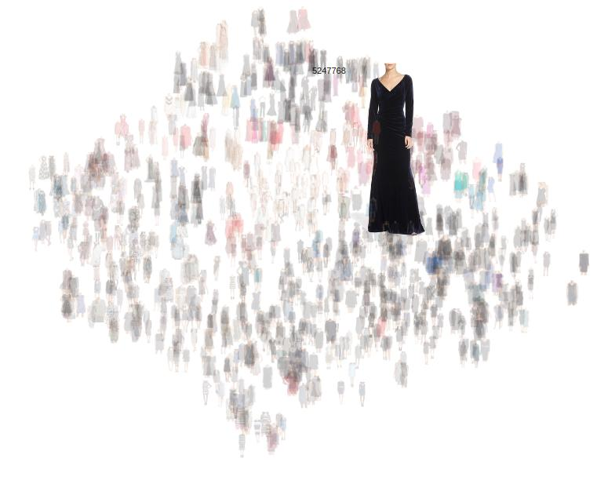

# dress-scatter
**Visualize dress embeddings**

Extract the features in extract_features-Nordstrom.ipynb

Then start a simple server with simple_server.lua (or rails/node/whatever you want)

Then display the scatterplot by going to 

*http://localhost:8080/public/scatter.html*

Hover over an image to show it full size. I am using local images to make this faster but feel free to tweak as desired.

This is a quick and dirty way I visualize the embeddings. Feel free to make a pull request to add your own.

I will try to write a blog post about this.

